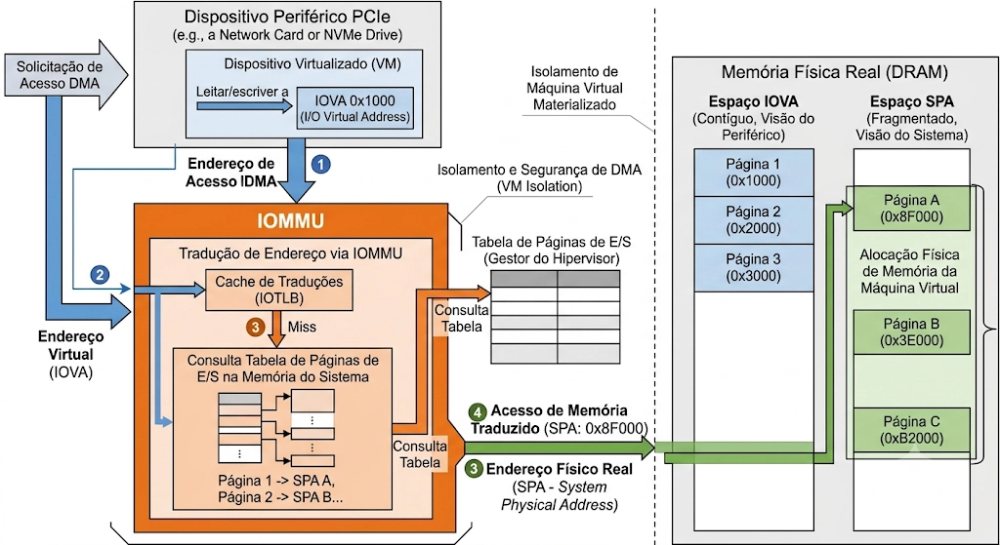
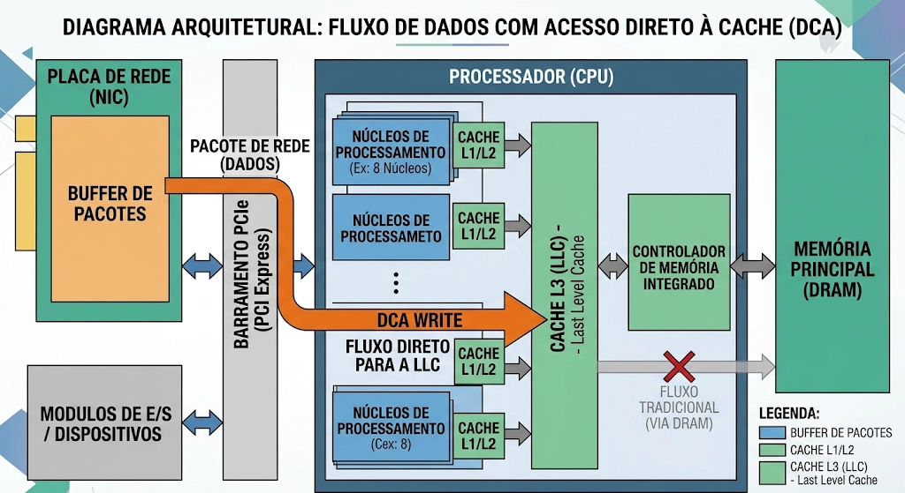

Glossário
=========

- **Barramento** → Canal físico passivo que transporta dados, endereços e sinais de controle entre CPU, memória e módulos de E/S. Não armazena nada.

- **Buffer** → Registrador temporário no módulo de E/S que resolve o descasamento de velocidades entre periféricos lentos e barramento rápido.

- **Módulo de E/S** → Intermediário lógico entre CPU e periféricos. Controla temporização, comunicação, buffering e detecção de erros.

- **Transdutor** → Componente que converte dados entre forma elétrica e outras formas de energia (ex: elétrico → luz no monitor).

- **Polling** → CPU verifica repetidamente um bit de estado (*READY/BUSY*) até o periférico estar pronto. Consome ciclos ociosamente.

- **Cycle Stealing** → DMA "rouba" um ciclo de barramento por vez, suspendendo a CPU momentaneamente sem salvar contexto.

<!-- end_slide -->

Evolução da Função de E/S
=========================

Módulos de E/S formam o **terceiro pilar da arquitetura de computadores**, ao lado da CPU e da memória. Conectar periféricos diretamente ao barramento é inviável: velocidades, formatos e métodos operacionais são incompatíveis.

A taxonomia de Stallings descreve como a responsabilidade foi progressivamente transferida da CPU para módulos especializados:

1. **Controle direto pela CPU** — processador gerencia toda lógica de temporização e amostragem de dados

2. **Módulo de E/S sem interrupções** — hardware gerencia o periférico, mas CPU faz *polling* do estado

3. **E/S por interrupção** — módulo sinaliza a CPU apenas quando dados estão prontos, eliminando espera ociosa

4. **DMA (Direct Memory Access)** — módulo transfere blocos entre periférico e memória; CPU só intervém no início e no fim

5. **Canais de E/S** — processador de propósito específico com conjunto de instruções próprio

6. **Processadores de E/S autônomos** — memória local dedicada, opera como sistema independente

<!-- end_slide -->

Arquitetura de um Módulo de E/S
==============================

```
+-------------------------------------------------------------------------+
|                          BARRAMENTO DO SISTEMA                          |
+---+------------------------------+------------------------------+-------+
    |                              |                              |
    Dados                       Endereços                       Controle
    |                              |                              |
+---+------------------------------+------------------------------+-------+
|                              MÓDULO DE E/S                              |
|                                                                         |
|  +--------------------+  +--------------------+  +--------------------+ |
|  | Reg. Dados Interno |  | Reg. Estado/Contr. |  | Lógica de Interface| |
|  +--------------------+  +--------------------+  +--------------------+ |
|           ^                         ^                         ^         |
|           |                         |                         |         |
|           +----------+--------------+                         |         |
|                      |                                        |         |
+----------------------+----------------------------------------+---------+
                       |
            +----------+----------+
            |  Sinais de E/S:     |
            |  Dados, Estado      |
            |  e Controle         |
            +----------+----------+
                       |
+----------------------v----------------------------------------------------+
|                          DISPOSITIVO PERIFÉRICO                           |
|                                                                           |
|  +--------------------+  +--------------------+  +--------------------+   |
|  | Lógica de Controle |  |  Buffer de Dados   |  |     Transdutor     |   |
|  +--------------------+  +--------------------+  +--------------------+   |
+---------------------------------------------------------------------------+
```

<!-- end_slide -->

Cinco Funções Nucleares do Módulo de E/S
========================================

De acordo com a taxonomia de Stallings, todo módulo de E/S deve desempenhar cinco funções obrigatórias:

1. **Controle e temporização**

2. **Comunicação com a CPU**

3. **Comunicação com o dispositivo externo**

4. **Buffering de dados**

5. **Detecção de erros**

<!-- end_slide -->

Dispositivos Externos: Tipos e Características
==============================================

Os periféricos são classificados pelo **alvo da informação** e pela **natureza da transdução**:

| Tipo | Alvo | Taxa de Dados | Latência | Exemplos |
| --- | --- | --- | --- | --- |
| **Inteligível ao humano** | Usuário final | Baixa (Bps a KBps) | Alta (percepção humana) | Teclado, monitor, display |
| **Inteligível à máquina** | Controladores | Alta (MBps a GBps) | Crítica (física do meio) | HDD, SSD NVMe, sensores |
| **Comunicação** | Redes/sistemas remotos | Ultra-alta (Gbps+) | Baixa e crítica | Ethernet, Wi-Fi 7, óptica |

**Dois padrões de operação:**

- **Fluxo de caracteres:** usado por dispositivos humanos (ex: teclado envia códigos ASCII por pressionamento de tecla).
- **Transdução em blocos:** usada por dispositivos de máquina (ex: disco lê e grava setores inteiros, exigindo buffers e ECC).

<!-- end_slide -->

Por que Buffering é Necessário?
===============================

A **CPU e a memória principal operam em velocidades muito superiores** à maioria dos periféricos.

Sem buffer, a CPU ficaria presa esperando o dispositivo liberar ou entregar cada byte, desperdiçando ciclos.

```
Periférico lento          Buffer no módulo de E/S          Barramento rápido
    ||                              ||                              ||
    ||  dados em pequenas doses     ||  dados acumulados em blocos  ||
    ||  --------------------------> ||  --------------------------> ||
    ||        KBps a MBps           ||         MBps a GBps          ||
```

**Função do buffer:**

- **Acumular dados** vindos do periférico antes de enviá-los ao barramento.
- **Absorver diferenças de velocidade** entre dispositivos lentos e o sistema rápido.
- **Liberar a CPU** para outras tarefas enquanto o buffer é preenchido.

Em sistemas modernos, o buffering evoluiu para **filas FIFO em silício** e **controle de fluxo por créditos**, evitando que grandes blocos de dados do barramento saturem o transdutor do dispositivo.

<!-- end_slide -->

E/S Programada e Mapeamento de Endereços
========================================

Na **E/S programada**, a CPU transfere dados diretamente para o módulo de E/S e fica em um laço verificando o bit **READY/BUSY** até que o dispositivo esteja pronto.

Existem duas formas de acessar os registradores do módulo de E/S:

| Característica | MMIO (*Memory-Mapped I/O*) | Isolated I/O |
| --- | --- | --- |
| Endereço | Mesmo espaço da RAM | Espaço de E/S separado |
| Instruções | Normais (`MOV`, `LDR`) | Especiais (`IN`, `OUT` no x86) |
| Uso comum | ARM, RISC-V | x86 legado |

No **MMIO**, os registradores de E/S são tratados como posições de memória, mas devem ser marcados como **não-cacheáveis** para evitar leituras de valores desatualizados.

<!-- end_slide -->

Por que MMIO Precisa Ser Não-Cacheável?
========================================

A CPU pode cachear registradores de E/S, mas eles mudam o tempo todo. Se forem cacheáveis:

- **Leitura desatualizada:** a CPU lê o valor antigo da cache, ignorando a atualização do dispositivo.
- **Escrita atrasada:** a escrita fica presa na cache (*write-back*) e não chega ao hardware.

**Solução:** marcar MMIO como **Uncacheable** e **Strongly Ordered**, forçando a CPU a acessar o registrador real diretamente.

<!-- end_slide -->

E/S controlada por interrupção e evolução dos co-processadores de interrupção
========================================

Técnica que mitiga problemas de ociosidade utilizando **requisições de interrupção**

A CPU **não permanece presa em laços de repetição**. Ela continua a execução de outras tarefas úteis e aguarda a requisição de interrupção do módulo E/S

Ao receber a requisição, a interrupção é tratado por uma rotina específica (ISR)

Finalizando a transação com o módulo E/S, a CPU volta a tarefa original sem perda de contexto

```
+-------------------------------------------------------------+
|                     BARRAMENTO DE SISTEMA                   |
+------------------------------+------------------------------+
                               |
                   +-----------v-----------+
                   |     I/O APIC (PCH)    | (Controlador de interrupções
                   +-----------+-----------+  de sistema no chipset)
                               |
               In-Band PCIe    | (Redirecionamento de Interrupção
               MSI-X Message   |  via barramento de sistema)
                               v
+-------------------------------------------------------------+
|                         CPU MULTICORE                       |
|                                                             |
|  +--------------------+             +--------------------+  |
|  |  Núcleo 0 (Core 0) |             |  Núcleo 1 (Core 1) |  |
|  |  +--------------+  |             |  +--------------+  |  |
|  |  |  Local APIC  |  |             |  |  Local APIC  |  |  |
|  |  +-------+------+  |             |  +-------+------+  |  |
|  +----------|---------+             +----------|---------+  |
|             v                                  v            |
|       MSI Vector 64                      MSI Vector 82      |
|    (Assigned to Core 0)               (Assigned to Core 1)  |
+-------------------------------------------------------------+
```

<!-- end_slide -->

Como determinar qual módulo gerou a requisição de interrupção?
========================================

Com muitos periféricos compartilhando a capacidade de interromper a CPU, como saber qual módulo gerou a requisição de interrupção?

**1. Múltiplas linhas de interrupção físicas**
  - Abordagem direta, fornece linhas físicas dedicadas e independentes no barramento entre cada módulo E/S e a CPU
  - **Vantagem:**
    - Extremamente rápida
  - **Desvantagem:**
    - Inviável para sistemas complexos devido à limitação física de pinagem do encapsulamento do processador

**2. Varredura de software**
  - Após a interrupção, a CPU é desviada para uma rotina geral de serviço que, primeiro, tem como objetivo identificar qual módulo E/S foi o autor da interrupção
  - É realizada uma varredura em cada módulo E/S para encontrar em seus registradores de estado o bit que indica a autoria da interrupção
  - **Vantagem:**
    - Barata em termos de hardware
  - **Desvantagem:**
    - Latência do sistema mais alta pelo tempo gasto interrogando cada módulo

<!-- end_slide -->

Como determinar qual módulo gerou a requisição de interrupção?
========================================

**3. Encadeamento de margarida (Daisy Chain)**

  1. Um ou mais módulos solicitam uma interrupção à CPU.
  2. Quando a CPU aceita a interrupção, ela envia um sinal de reconhecimento (`Interrupt Acknowledge`), que percorre os módulos em série.
  3. O primeiro módulo que possui uma interrupção pendente intercepta esse sinal, impedindo que ele continue para os demais módulos.
  4. Em seguida, esse módulo coloca seu identificador (vetor de interrupção) no barramento de dados, permitindo que a CPU identifique qual dispositivo solicitou a interrupção e execute a rotina de tratamento correspondente.
  - **Vantagem:**
    - Implementação simples e de baixo custo, prioridade entre os dispositivos é definida pela ordem física
  - **Desvantagem:**
    - A prioridade entre os dispositivos é fixa, dispositivos mais próximos da CPU sempre têm precedência

**4. Arbitragem de Barramento**

  - Os dispositivos de E/S solicitam acesso ao barramento através do **árbitro de barramento**
  - A prioridade de acesso ao barramento é definida por ele
  - O dispositivo escolhido pelo árbitro recebe o nome de ***bus master***
  - Esse dispositivo coloca seu identificador nas linhas de dados e a CPU executa a rotina de tratamento correspondente
  - **Vantagem:**
    - Maior flexibilidade e desempenho, pois a prioridade pode ser configurável ou dinâmica, evitando que um dispositivo fique permanentemente em desvantagem.
  - **Desvantagem:**
    - Hardware mais complexo e mais caro, devido à necessidade de um mecanismo dedicado para arbitrar o acesso ao barramento.

<!-- end_slide -->

Evolução de PIC para APIC e MSI-X
========================================

O tratamento de interrupções clássico, baseado em **PIC** (Programmable Interrupt Controller), tornou-se insuficiente para lidar com a complexidade dos sistemas modernos.

Com o surgimento de arquiteturas multicore, foi necessário evoluir para **APIC** (Advanced Programmable Interrupt Controller) composta por unidades locais **LAPIC** integradas individualmente em cada núcleo da CPU

Posteriormente, abandonando as linhas físicas analógicas de interrupção, surgiram as Interrupções Sinalizadas por Mensagem (**MSI** e **MSI-X**) no barramento PCI Express

No **MSI** e **MSI-X**, o dispositivo E/S realiza uma escrita de dados na banda principal do barramento PCIe apontando para um endereço de memória especial pertencente ao **LAPIC** do processador

No **MSI-X**, cada vetor possui um endereço de memória física de destino e uma palavra de dados específica definidos em uma tabela dinâmica mantida na memória interna do periférico, permitindo que cada interrupção seja direcionada a um núcleo específico da CPU

<!-- end_slide -->

Evolução de PIC para APIC e MSI-X
========================================

## PIC Legado
- Centralizado em uma única CPU monolítica
- Mapeado por pinagem e portas de controle físicas

## MSI
- Restrito a um único núcleo ou conjunto fixo de núcleos simultâneos
- Endereço físico e palavra de dados fixos gravados na inicialização
- Menor flexibilidade e desempenho em sistemas multicore

## MSI-X
- Flexível; cada interrupção pode ser direcionada a qualquer núcleo individual
- Tabela na memória do dispositivo mapeada dinamicamente por vetor
- Vetores em maior quantidade e mais flexíveis, permitindo melhor desempenho em sistemas multicore

<!-- end_slide -->

Acesso Direto à Memória (DMA)
========================================

Elimina a desvantagem inerente à E/S controlada por interrupções em fluxos de transferência de alto volume, onde cada byte que transita da memória principal para o periférico deve passar obrigatoriamente pelos registradores da CPU

Funciona como um **coprocessador** especialista, assumindo o controle temporário dos barramentos do sistema para transferir blocos de dados diretamente entre os periféricos e a memória física através da técnica de roubo de ciclos (***cycle stealing***)

```
                            SISTEMA MULTIPROCESSADOR
+-----------------------------------------------------------------------------+
|  +--------------------+                               +------------------+  |
|  |     CPU Core       |                               |      IOMMU       |  |
|  +---------+----------+                               +--------+---------+  |
|            |                                                   ^            |
|            v  Tradução MMU                                     |            |
|    +---------------+                                           |            |
|    | Virtual Memory|                                           | Tradução   |
|    +---------------+                                           | IOVA -> SPA|
|            |                                                   |            |
|            +---------> --------+            |
+-----------------------------------------------------------------------------+
                                     |
                                     v
+-----------------------------------------------------------------------------+
|                      Memória RAM Principal (DRAM)                           |
+------------------------------------+----------------------------------------+
                                     ^
                                     | Escrita direta na RAM (SPA)
+------------------------------------+----------------------------------------+
|                               PCIe Bus                                      |
+------------------------------------+----------------------------------------+
                                     ^
                                     | Transação com endereço IOVA
+------------------------------------+----------------------------------------+
|                        Dispositivo Periférico PCIe                          |
+-----------------------------------------------------------------------------+
```

<!-- end_slide -->

DMA Scatter-Gather
========================================

O DMA tradicional depende de blocos contíguos de memória sendo limitado quando os dados estão fragmentados na RAM

Na estrutura ***Scatter-Gather*** DMA, surgem os anéis de descritores alocados na memória do sistema

Cada descritor aponta para um endereço não contíguo e especifica a quantidade de dados

O módulo de DMA executa varreduras sequenciais nos descritores físicos, encadeando a transferência de múltiplas regiões de RAM não contíguas

```
+----------------------------------------------+
|                                              |
| +------------------------------------------+ |
| |                   RAM                    | |
| |                                          | |
| |  [Bloco A]     [Bloco C]      [Bloco B]  | |
| |                                          | |
| +------------------------------------------+ |
|        ↓             ↓              ↓        |
|                                              |
|                Descritores DMA               |
|                                              |
|                  A → C → B                   |
|                                              |
|                      ↓                       |
|                                              |
|                Controlador DMA               |
+----------------------------------------------+
```

<!-- end_slide -->

Mecânica de tradução IOMMU
========================================

Adicionando uma camada de segurança, ***IOMMU*** atua como uma barreira lógica inserida na raiz do barramento PCIe. Sob esse modelo, os periféricos passam a referenciar os endereços em um espaço virtual específico de E/S chamado de Endereço Virtual de E/S (I/O *Virtual Address* - IOVA)

O IOMMU intercepta transações do ciclo PCIe e realiza a tradução para o endereço físico correspondente usando uma tabela de páginas de E/S

A segurança adicional impõe custo de latência de barramento, para amenizar esse custo as IOMMUs utilizam caches internos de tradução conhecidos como IOTLBs (I/O Translation Lookaside Buffers)

Sistemas operacionais de alto rendimento utilizam modos otimizados de controle
- **Modo Pass-Through (*intel_iommu=on iommu=pt*)**
  - Ignora a tradução de dispositivos que operam nativamente no host
- **Modo Diferido (*Lazy/Deferred Mode*)**
  - Invalida o cache em lote em vez de realizar chamadas de invalidação a cada desalocação de página



<!-- end_slide -->

Tecnologias de controle de DMA
========================================

| **Característica** | **DMA Clássico** | **Scatter-Gather DMA** | **DMA com IOMMU**
| --- | --- | --- | --- |
| Endereço | Endereços físicos e contíguos | Cadeias de endereços físicos | Endereço virtual traduzido pela IOMMU
| Segurança de acesso | Inexistente | Inexistente | Acesso restrito a páginas explicitamente mapeadas
| Penalidade de latência | Nula no nível do barramento | Baixa, gerada pela varredura dos anéis | Moderada devido à tradução

<!-- end_slide -->

Acesso Direto à Cache (DCA)
========================================

**Proposta:** Solucionar o gargalo do DMA gerado pela necessidade de constante acesso à DRAM física

**Solução:** O DCA soluciona essa restrição ao permitir que os pacotes de dados de E/S provenientes de dispositivos PCIe sejam injetados diretamente na cache de último nível (L3)



<!-- end_slide -->

Canais e E/S e programas de canal
========================================

# Canais de E/S
- Operam como um processadores copartícipe autônomos e de propósito específico, dotados de seus próprios conjunto de instruções de manipulação de barramento especializado para operações de E/S
- Execuções de rotinas de E/S de baixo nível são transferidas para o canal
- CPU passa a tratar apenas a inicialização do canal e a indicação da localização de um **Programa de Canal** para o mesmo

# Programas de Canal e Offloading
## ***Offloading***
- Transferência de responsabilidade de execução de rotinas de E/S da CPU para o canal
- Com os canais, a CPU deixa de interagir de forma direta com sinais de controles mecânicos, trilhas físicas de disco ou barramentos de rede

## Programas de Canal
- Construído por uma sequência lógica de Palavras de Comando de Canal (CCWs)
- As CCWs instruem o hardware do canal sobre quais setores ler, quais blocos varrer, onde alocar os dados de recebimento na memória principal e quais ações corretivas de hardware tomar em caso de falhas
- Organizados em duas grandes classes:
  - **Canal seletor:** Dedica-se de forma exclusiva e ininterrupta à transferência de dados com um único dispositivo de alta velocidade a cada vez, controlando um pequeno cluster de controladores.
  - **Canal multiplexador:** Permite que múltiplos dispositivos de baixa velocidade compartilhem o mesmo canal, alternando entre eles de forma rápida e eficiente.
    - **Multiplexador de Byte:** Para periféricos lentos
    - **Multiplexador de Bloco:** intercalando registros e blocos de dados completos em transações síncronas rápidas de múltiplos periféricos rápidos de armazenamento

<!-- end_slide -->

Padrões de interconexão externa e tecidos de rede de alta velocidade
========================================

# Barramentos de interconexão externa
- Estabelecem as interfaces físicas, elétricas e de sinalização de dados que interligam os controladores internos aos dispositivos periféricos e equipamentos remotos.
- Evolução de barramentos paralelos para barramentos seriais
  - **Barramentos paralelos:**
    - Vários bits transmitidos simultaneamente.
    - Limitados por interferência, capacitância e sincronização.
    - Adequados apenas para curtas distâncias.
  - **Barramentos seriais:**
    - Poucos fios operando em alta frequência.
    - Comunicação baseada em pacotes.
    - Maior velocidade, confiabilidade e escalabilidade (PCIe, USB, SATA).

```
                     EVOLUÇÃO DOS TECIDOS DE CONECTIVIDADE
+-----------------------------------------------------------------------------+
|                               PCIe Gen 6                                    |
|   - Interface física e elétrica baseada em link serial ponto a ponto        |
|   - Codificação elétro-analógica PAM-4 com sinalização de 64 GT/s           |
+-------------------------------------+---------------------------------------+
                                      |
                                      | Camada de Transporte Física
                                      v
+-------------------------------------+---------------------------------------+
|                    COMPUTE EXPRESS LINK (CXL v3.1)                          |
|                                                                             |
|  +-----------------------+  +-----------------------+  +-----------------+  |
|  |        CXL.io         |  |       CXL.cache       |  |     CXL.mem     |  |
|  | - Transações normais  |  | - Acesso coerente     |  | - CPU acessa    |  |
|  |   de controle PCIe.   |  |   do acelerador à L3. |  |   RAM do acc.   |  |
|  +-----------------------+  +-----------------------+  +-----------------+  |
+-----------------------------------------------------------------------------+
```

<!-- end_slide -->

***Compute Express Link (CXL)*** protocols
========================================

- Opera de forma paralela sobre a infraestrutura física e analógica de links diferenciais do PCIe Gen 5 e Gen 6

- Possui três sub-protocolos dinamicamente multiplexados em flits (unidades de controle de fluxo de dados de alta eficiência elétrico-lógica):
  - **CXL.io** → Transações de controle PCIe padrão, compatível com dispositivos PCIe existentes
  - **CXL.cache** → Permite que aceleradores acessem a cache L3 da CPU de forma coerente, compartilhando dados com a CPU sem cópias redundantes
  - **CXL.mem** → Permite que a CPU acesse a memória local do acelerador, expandindo o espaço de memória do sistema e permitindo o uso de memória não volátil como RAM

- Classifica os dispositivos em 3 categorias:
  - **Dispositivos tipo 1 (SmartNICs)**
  - **Dispositivos tipo 2 (GPUs e FPGAs de alto desempenho)**
  - **Dispositivos tipo 3 (expansores de memória)**

<!-- end_slide -->

Padrões de conectividade de uso geral e periféricos de consumo
========================================

| **Interface** | **Aplicação típica** | **Destaque** |
|:-------------|:---------------------|:-------------|
| USB | Mouse, teclado, pendrive, webcam | Universal, hot-plug e fornece energia |
| FireWire (IEEE 1394) | Câmeras digitais e áudio profissional | Transferência isócrona e comunicação *peer-to-peer* |
| Thunderbolt | Monitores, docks, SSDs externos | Alta largura de banda e transporte PCIe/DisplayPort |
| SATA | HDDs e SSDs internos | Interface dedicada para armazenamento |
| Ethernet / Wi-Fi | Redes locais e Internet | Comunicação entre computadores e dispositivos remotos |


<!-- end_slide -->

Estrutura de E/S de alto desempenho
========================================

# IBM zEnterprise EC12
- Arquitetura E/S dedicada projetada para eliminar por completo penalidades de processamento
- Subsistemas de canais dedicados (CSS - ***Channel Subsytem***)
- Descarregamento de tarefas para Processadores de Assistência de Sistema (SAP) especializados

```
                IBM zENTERPRISE EC12 I/O SYSTEM
+-------------------------------------------------------------+
|               Gaiola de Processadores Primários             |
|                                                             |
|  +------------------------+     +------------------------+  |
|  |     Processor Book     |     |     Processor Book     |  |
|  |  +------------------+  |     |  +------------------+  |  |
|  |  |    Active SAP    |  |     |  |    Active SAP    |  |  |
|  |  +--------+---------+  |     |  +--------+---------+  |  |
|  +-----------|------------+     +-----------|------------+  |
+--------------|------------------------------|---------------+
               | InfiniBand                   | PCIe
               | Fanout                       | Fanout
               v                              v
+--------------+------------------------------+---------------+
|                Mecanismo de Fanouts / Comutadores           |
+--------------+------------------------------+---------------+
               |                              |
               v                              v
+--------------+-------------+    +-----------+---------------+
| Gaiola de E/S / I/O Drawer |    | I/O Drawer PCIe           |
|                              |                              |
|  +-----------------------+  |    |  +--------------------+  |
|  | Multiplexador ESCON   |  |    |  | Comutador PCIe     |  |
|  +-----------+-----------+  |    |  +--------+-----------+  |
|              |              |    |           |              |
|              v              |    |           v              |
|  +-----------+-----------+  |    |  +--------+-----------+  |
|  | Fita / Armaz. de Fibra|  |    |  | Canal de Fibra 16G |  |
|  +-----------------------+  |    |  +--------------------+  |
+-----------------------------+    +--------------------------+
```